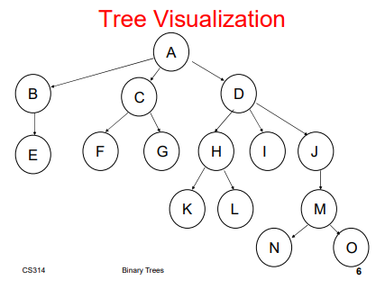
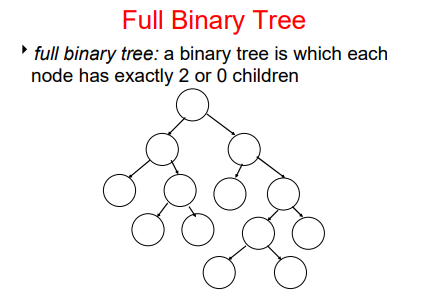
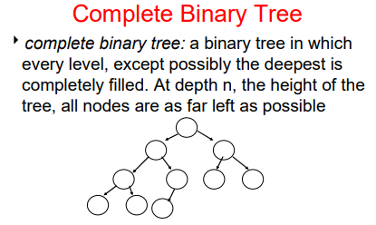
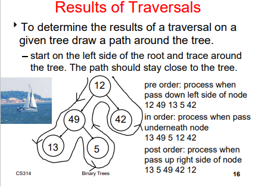
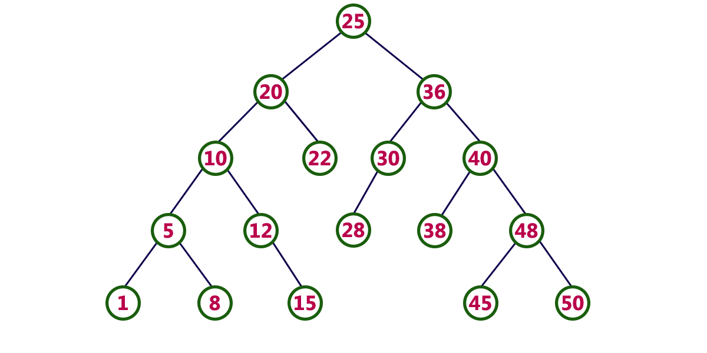

# Tree
### Nodes
- Root Node: Entry point
- Each Node is a leaf Node or internal Node
  - Leaf Node: A Node without any children Nodes
  - Internal Node: A Node with children Nodes
- Siblings Nodes are Nodes with the same parent Node

### Tree Structure
- Edge/Path: A branch within the tree
- Path Length: The number of edges that must be traversed to get from one Node to another
- Depth: The path length from the root Node to a target Node
  - Level = Depth + 1
- Height: The path length from an internal Node to its furthest leaf Node

</img>

# Binary Tree
Each Node has no more than two children.
- The "possible" children are referred to as the left and right child

### Full Binary Tree
Each Node has exactly 2 or 0 children.

</img>

### Complete Binary Tree
Every level, except the deepest depth, is completely filled. At the deepest depth, all Nodes are to the far left.
- Filled in from left to right, top to bottom
- The height of a complete binary tree with N Nodes is O(log2(N))
  - Ex: Let's say there 8 Nodes for a complete binary tree, then log2(8) = height of 3
  
</img>
  
### Perfect Binary Tree
All interior Nodes have two children, and all leaf Nodes at the same depth (very bottom).
- Has 2^(n+1) - 1 Nodes where n is the height of the tree

# Binary Tree Traversal
</img>

### Level-order
Starting from the root of a tree, process all nodes at the same depth from left to right, then proceed to the nodes at the next depth

### Pre-Order
Process the root, then process all subtrees (left to right)
- Only process when the sailing meets the Node from the left

### In-Order
Process the left sub tree, process the root, process the right sub tree
- Only process whenever the sailing meets the Node from the bottom
- Make sure the child Nodes are drawn with a 45 degree angle from their parent Node

### Post-Order
Process the left sub tree, process the right sub tree, then process the root
- Only process whenever the sailing meets the Node from the right

### Program for Printing Pre-Order, In-Order, and Post-Order Traversal
```java
public static void traversal(BNode node) {
   if(node != null) {
       // print the Node here for pre-order
       traversal(node.getLeft());
       // print the Node here for in-order
       traversal(node.getRight());
       // print the Node here for post-order
   }
}
```
# Binary Search Tree (BST)
A binary tree in which every node's left subtree holds values less than the node's value, and every right subtree holds values greater than the node's value.

</img>

### In-order Traversal of BST
When doing an in-order traversal of a BST, the traversal processes the tree in-order from least to greatest.

### Adding into a BST
If the Node's value being added is already within the Tree, then it does not add the duplicate (acts like a Set).   

The naive add algorithm: Whenever adding a new element into the Tree, it adds based on comparing the value of a Node's data. If the element is less than the Node's data, then it traverses left, if greater than then it traverses right. The base-case is when replacing a null-link, thus adding onto a leaf Node's link.
- Best and Average-case: O(log2(N)) <- Whenever the Tree is complete, so height is O(log2(N))
	- Occurs whenever adding elements in random, distinct order
- Worst-case: O(N) <- Whenever the Tree is linear, so must traverse through entire tree
	- Occurs whenever adding elements in ascending or descending order

### Removing from a BST
1. If removing a leaf, null it out.  
2. If removing an internal Node that has only one child, make the parent Node link to its one child.  
3. If it's an internal Node with 2 children:
	- Replace the Node with the max Node on its left-subtree (the very-right Node of left-subtree)
	- Recursively replace until the Node is replaced with its maximum left-subtree Node
