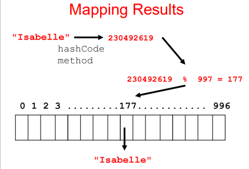

# HashTable
Overcomes the problems of an ArrayList while maintaining the fast access, insertion, and deletion in terms of N.
- Uses an Array and Hash functions to determine the index for each element
- Cannot contain duplicate keys, by convention the newest key will override the old key

### Usages of HashTables in Java
1. HashTable class
2. HashSet class
- Implements the Set interface with the internal storage container as a HashTable
- Compare this to the TreeSet class, which uses an internal storage of a Red Black Tree
3. HashMap class
- Implements the Map interface with the internal storage container as a HashTable for the keys

### Comparing Time Complexity to Add for Other Data Structures
1. Java's HashSet (fastest), O(1) average-case; it's faster than HashTable314 because of small T(N) efficiencies
2. HashTable314 (fast), O(1) average-case
3. Naive BST (medium), O(log2(N)) average-case
4. Java's TreeSet (slowest), O(log2(N)) average-case + balancing time because of Red-Black Tree implementation

### Hash Functions
- Hash: To mix or randomly shuffle
- Hash Function: Take a large piece of data, reduce it to smaller pieces of data
  - Typically reduces to a single integer used to index onto an Array

Example of a Hash Function:  
Assume we are using our names as the "key."
- Take 3rd letter of the name, take integer value of the letter, divide by 6, then take remainder
- Ex: ```"Pravat" -> 'a' = 1 -> 1 % 6 = 6``` so 6 is the hash key

The example above uses the "mapping" technique. The example above is NOT a perfect hash function.
- Perfect Hash Function: A hash function that yields one to one mapping from the keys to the hash values

# Hashing Techniques
Tranforming a Key to an Integer can use 4 techniques:
1. Mapping: Integer values or Object keys that that can be easily converted to integer values
2. Folding: Partitioning a key into several parts, and the integer values for the various parts are combined
  - The parts may be hashed first
  - The combination can use addition, multiplication, shifting, logical exclusive OR, etc.
3. Shifting: Use Bitwise operators to shift keys into integers, gives a better range of hash values than folding
4. Casting: Very simple, such as casting characters to integers in Java

### How to Implement The "Mapping" Technique
The mapping technique transforms a hashed key into a legal index on a HashTable's Array container. Therefore, in average-case it takes O(1) time to get the value of a key.

Typically, get the key's index in the Array container by doing the modulus of the result of the hash function (which gets the hashed key) and the Array container's length
- ```index = hashedKey % length```
- Empirical evidence shows prime number as best for the length
  - Ex: If the Array container's length is 1000, then determine the index using 997 or 1009
  
###### Re-sizing The HashTable
Whenever we resize the HashTable, we must re-hash all the keys within the table using the new length of the Array.
- This is because we want to maintain the relative distance of every element in the HashTable to make it spread-out
  - This also helps prevent collisions since the old hashes uses the old length, so hashing using the new length may collide any new keys added into the table
  
###### Visual Example of The Mapping Technique
</img>

# Hashing Collisions
Hashing Collisions happen whenever two different keys map to the same index within the Array container.

For Strings, it uses the ```hashCode``` method which actually prevents collisions. How it works is that for each character and its position in the String, the String's hash is the sum of the unicode of each character multiplied by its position in the String.

Below are techniques to fix Hashing Collisions.

### Open Addressing (Harder, and Not Conventional)
Search forward of backwards for an open space in the Array container.
- Linear Probing: Move forward spots until finding an open index.
  - Null if never occupied an index
  - When removing, replace the index as a blank
- Quadratic Probing: Moving 1 spot, 2 spots, 4 spots, 8 spots, 16 spots, etc.

###### How To Do "Get" with Duplicate Keys
Let's say the client requests for a key's value, but the key is a duplicate key in the HashTable
- The program hashes the sent key, and receives its index
- Then the program goes to the index and checks if the index's key is equal to the sent key
  - If yes, then return the key's value
  - If not, then go to the very beginning of the Array and search for the sent key

### Closed Addressing (Easier, and Conventionally Better)
Each element of the HashTable is another data structure (called a bucket).
- Such as a LinkedList (recommended), balanced BST, etc.
- This takes more space, but it's easier to implement

###### How To Do "Get" with Duplicate Keys
Let's say the client requests for a key's value, but the key is a duplicate key in the HashTable
- The program hashes the sent key, and receives its index
- Then the program goes to the index and searches the data structure until finding the sent key

# Implementing a HashTable in Java
Use the hashCode method from the Object class to receive an integer index of the Object key
- Notes to remember about hashCode and equals:
  - If two Objects are equal according to the equals method, then calling hashCode would produce the same integer result
  - If you override equals, you MUST override hashCode or else it may cause logic errors
