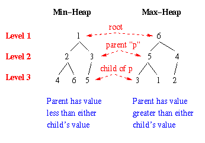
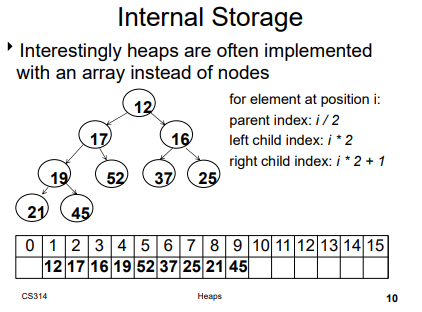

# Heaps
A complete binary tree, typically used to create Priority Queues for maximum and minimum values.

</img>

### Heap Container
Heaps use an Array container instead of Nodes because of a Heap's order property.

</img>

# Max Heap
Heap Order Property: The value in the root of any sub-tree is greater than or equal to all other values in the sub-tree.

### Enqueue for Max Heap
1. Add new element to the next open spot in the Array
2. Swap with its parent if the new element is greater than its Parent.
3. Trickle-up: Continue back-up the tree as long as the new value is greater than the new parent Node.

### Dequeue for Max Heap
The root Node (maximum value) will be dequeued because it's the front.  
1. Set the first element (root) to the last element in the Array.
2. Trickle-down: Swap the element with its children as long as the element is greater than its children.

# Min Heap
Heap Order Property: The value in the root of any sub-tree is less than or equal to all other values in the sub-tree.

### Enqueue for Min Heap
1. Add new element to the next open spot in the Array
2. Swap with its parent if the new element is less than its Parent.
3. Trickle-up: Continue back-up the tree as long as the new value is less than the new parent Node.

### Dequeue for Min Heap
The root Node (minimum value) will be dequeued because it's the front.  
1. Set the first element (root) to the last element in the Array.
2. Trickle-down: Swap the element with its children as long as the element is less than its children.

### Time Comparisions for Heap vs BST
Heaps are faster than a Binary Search Tree whenever utilizing it as a Priority Queue, but not quite twice faster. This is because when given random N, the height of a Heap is roughly log2(N) while the Binary Search Tree is roughly 2*log2(N).  

Therefore, whenever enqueuing or dequeuing Nodes from a Heap, it would take less to traverse once the program finds the proper location it would short-circuit the code. However, for a BST, it would need to traverse to the very left or very right of the tree to enqueue or dequeue maximum and minimum.  

So, we can say approximately Binary Search Trees take twice as long in the average-case to enqueue/dequeue Nodes while Heaps take approximately half or greater that time.
