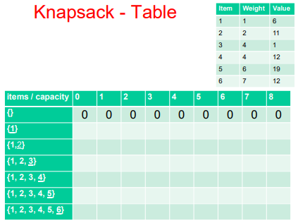
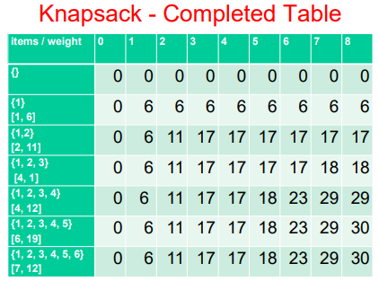

# Dynamic Programming (DP)
A method to solve complex problems by breaking them into smaller, easier, sub-problems.  
- Ex: Recursion, breaks the problem into sub-problems using different method parameters

The solution to the original problem can be calculated from results of smaller problems.
- Sub-problems have a natural ordering from smallest to largest OR simplest to hardest
  - Therefore, larger problems depend on previous solutions
  
### DP Algorithm
1. Define the sub-problems using Mathematics/English.  
2. Determine where the solution will be found.  
3. Determine how to create the first sub-problem.  
4. Determine the order in which the sub-problems will be solved.  
5. Determine how to compute the final answer using the previously computed sub-problems.

# Memoization
Store (cache) results from functions such as method calls for later look-up.

We can use a data structure like an ArrayList to store each method(N) result, then if the user asks to see the results of the
same method(N) it would just return the index corresponding to N, which would be O(1) fast look-up instead of re-doing
the redundant program.

However, a drawback is the space and time trade-off since the data structure would sacrifice more space for time.

# Fibonacci Problem using Dynamic Programming
For Fibonacci, we implemented it using recursion with the naive method: ```f(n) = fib(n - 1) + fib(n - 2)```
- However, the time complexity of this method is O(2^N) and calls many redundant method calls
- Therefore, instead of using recursion, we can use iteration to prevent redundant method calls

### Memoization of The Fibonnacci Problem
1. Check if N is present in the ArrayList, if it is then return the value  
2. Check if N - 1 and N - 2 are present, if they are then return the sum of the two values  
3. If neither are available, do the regular implementation of fibonacci (use iteration for efficiency)

# 0-1 Knapsack Problem using Dynamic Programming
A "bin packing" problem where you have a set of items and each item has a weight and value. You have a knapsack with a weight limit. The goal is to maximize the value of the items to put into the knapsack without exceeding the weight limit.
- Could do recursively, but this would take forever

Instead, we can memoize the problem. Create a 2D Array that shows the value of putting or not putting an item into the sack.

### Knapsack Example Problem
Here's an example below, where the item number, weight of item, and value of item for each item is shown.
- The weight limit is 8, so the columns go from 0 to 8
- The rows represent the list in each state, where an item is added per row

</img>

### Interpreting The Matrix
It's a greedy algorithm, in which the program fills each cell with its most optimal solution.
- For example, on row 3 and column 3, fill the cell with the greatest value from the set of items {1, 2, 3} for a weight limit of 3
  - The answer to this is 17
  - Because item 1 (value of 6, weight of 1) and item 2 (value of 11, weight of 2) would exactly equal a total weight of 3 and a total value of 17
  - Therefore, 17 is the greatest value possible under the restriction of the weight limit from the set of items
  
The formula to calculate each cell within the matrix is: ```V[i, w] = max(V[i - 1, w], V[i - 1, w - w[i]] + P[i])```
- ```V[i, w]``` is the value in a cell where i = index (row), w = weight (column)
- ```V[i - 1, w]``` is the value in the cell above the current cell
- ```V[i - 1, w - w[i]] + P[i]``` is the value of the cell
  - ```P[i]``` is the value for the latest item in the set for row i
  - ```w[i]``` is the weight for the latest item in the set for row i
  
This implementation works because the 2D Array is structured so that each cell contains the largest value per state. Therefore, we can traverse the matrix while subtracting costs to find the greatest value for a current cell by comparing the values with and without the item into the knapsack.
- This comparision is done by placing the greater value (maximum) between ```V[i - 1, w]``` (do not add item into sack) versus ```V[i - 1, w - w[i]] + P[i]``` (the highest value possible without the added item, ```V[i - 1, w - w[1]]```, plus the added item, ```P[i]```, into the sack)

Here is the matrix once completed:

</img>

Therefore, the answer to the example problem is 30 (bottom-right cell).
