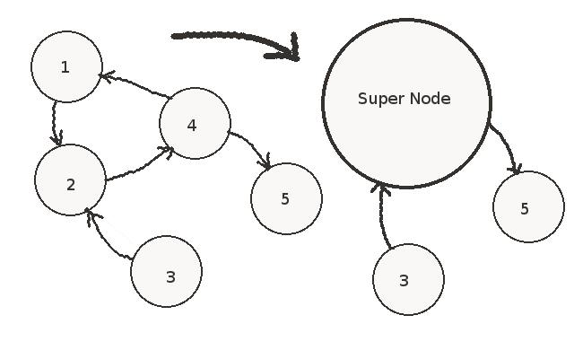
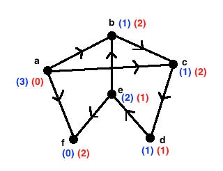

# The Seven Bridges of Konigsberg (Kaliningrad) Problem
The river Pregel flows through the city, and 7 bridges cross the river. Can you cross all bridges while
crossing each bridge only once?
- Turns out there are only 0 solutions to this problem

###### Euler's Proposal
Leonhard Euler drew the problem as a multigraph and determined it's impossible.

</img>

Based on his graph, it's only possible to cross each edge (bridge) only once and return to the starting point if and only
if every vertex has an even number of edges.
- This is called the Eulerian Circuit

What if we reduced the problem to only crossing each edge (bridge) exactly once?
- Basically, doesn't matter if we end up where we started, called a Eulerian Trail
- Then there would be multiple solutions

# Graphs
- Graph: Comprised of a set of vertices and a set of edges
  - Vertex: A graph Node
  - Edge: A link connecting one vertex to another; a single edge connects 2 vertices
- Directed Graph (Digraph): A graph where its edges are one-way
  - Movement allowed from first Node to second Node, but not second Node to first Node
  - The direction is typically shown using arrows
  
</img>

- Undirected Graph: A graph where its edges are two-way
  - Movement allowed in either direction
  
</img>

- Disconnected Graph: A graph where some vertices are not connected, while still considered a single graph

</img>

- Connected Graph: A graph where all vertices are connected

</img>

### Weighted Graphs
Sometimes graphs have a "weight" or cost when travelling along an edge. This is called a weighted graph.

</img>

- Path: A sequence of vertices connected by edges
  - Path Length: Number of edges in a path
  - Weighted Path Length: Sum of the costs of the edges in a path

### Cycles in Graphs
</img>

- Cycle: A path with a path length of 1 or more that starts and ends at the same vertex
  - Directed Acyclic Graph: Directed graph with NO cycles
  
### In-degree vs Out-degree for Directed Graphs
- In-degree: Number of edges a vertex receives
- Out-degree: Number of edges a vertex sends

</img>

### Dense vs Sparse Graphs
- Dense Graph: A graph with a large number of edges, needs a specified maximum number of edges
  - Adjacency Matrix is a reasonable choice to represent this
  - Note: There's no standard cutoff for the "maximum number of edges" because it depends on the problem
- Sparse Graph: A graph in which the number of edges is much less than the maximum possible number of edges
  - Most graphs are actually sparse
  - Adjacency list is the best way to represent this, which is an alternative that uses less
  space than an adjacency matrix
  
### Calculating Maximum Number of Edges on Graphs
What's the maximum number of edges in an undirected graph (excluding multigraphs) and directed graph with N vertices?
- Undirected Graph (excluding multigraphs) is: ```N*(N - 1) / 2```
- In a directed graph, it needs twice as many edges since Nodes CANNOT go both ways, so it's ```N*(N - 1)```

In a game of Scrabble, there are 5-letter words with a total of 8660 words (vertices). There exists edges between each
word if they are one letter different. In this graph, it showed 24,942 edges.  
Is this graph a Sparse or Dense graph?
- Well, since it's an undirected graph, the maximum number of edges are N * (N - 1) / 2 = 37,493,470 where N = 8660
- Clearly, that's a very small number compared to 24,942 edges, so it's a Sprase graph

### Unweighted Shortest Path Algorithm
To find the unweighted shortest path between vertices, do a breadth first search (using the Queue data structure)
- Diameter: Longest shortest path in a graph
- Center: A vertex that connects to the largest number vertices while having the shortest average path-length

###### Algorithm Implementation
1. Set the distance of the starting vertex to 0 
2. Create a Queue, and add the starting vertex
3. While the queue is not empty
  - Remove the front of the Queue
  - Loop through all edges of the current vertex
  - Get the Node that the edge connects to
  - If this Node has not been visited
    - Increment the current distance
    - Set the previous Node to the current Node
    - Add a new Node to the Queue
