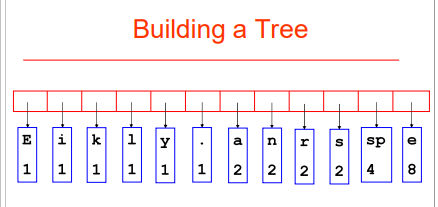
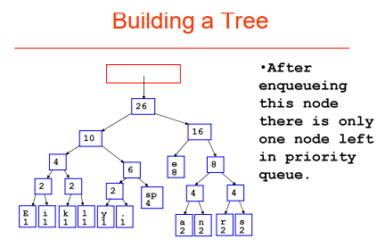
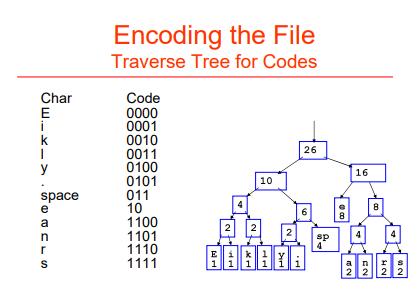

# Encoding
The example below shows encoding from characters, to ASCII numbers (base 10), to 8-bit binary numbers (base 2).
- Ex: UTCS -> 85 84 67 83 -> 01010101 01010100 01000011 01010011

In terms of file systems, many different files have different encoding schemes. For example, png, jpg, gif, etc.
- ASCII is just a very old scheme designed for Ameican English
- Nowadays we use Unicode (a superset of ASCII), which incorporates many other world languages

### What is a file?
All files may or may not have different encoding schemes.
- A software would decode this encoding scheme to get the file's proper contents

### Serialization
A way to write an Object data-type from Java onto a file.
- Ex: Evil Hangman's "eht" file was serialized by Mike Scott

# Compression
Using a different encoding scheme to store the same data while using less space.
- Lossless Compression: Decompressing leads to the exact same data, no alterations
- Lossy Compression: Decompressing leads to a slightly different data before compressing
  - Ex: jpg files: zoom-in to a jpg file and you'll see blurriness, called lossy artifacts
  
### Why bother with compression?
Physical memory is cheap, so why do we care about compression?
- Because the physics of moving data via a network (like the internet) is laggy, so we need data to be compressed
throughout the network

Think of how AT&T claims I can download at 40 Mbps (mega bits per second), but if we compress the data
downloaded through my internet the file can be downloaded faster.
- Also, note that 40 Mbps = 5 MBps (meta bytes per second) because 8 bits = 1 byte

Let's say my CPU can do 1*10^10 instructions per second, but my network can only do 5*10^6 instructions per second.
- This leads to a huge bottleneck due to the network capabilities, so my data would take forever to process

# Huffman Coding
An algorithm that can be applied to any type of file by looking at the chunks of a file (such as 8 bit chunks).
- Creates short code for characters that occur frequently (like a or e), but long codes for infrequent
characters (like x or z)
  - This is because in ASCII all characters are allocated the same amount of space even though they're not used as frequently

Note: The largest number you can represent with 8 bits is 11111111 (or 255 in decimal notation).
- Therefore, ASCII characters can only go up to 255 characters.

### Huffman Encoding Data Structures
Step 1: Determine the frequency (weight) of all characters in the file
- Use an Array of integers to put the keys (ASCII number) and value (frequency of character) to each index
  - Ex: If the character is "A", that's an ASCII of 65 so the Array increments index 65 by 1
  
Step 2: Create a Priority Queue where Node with lower frequencies have a higher priority
- Enqueue a Binary Tree Node for each key that has a frequency greater than 0
    
Step 3: Build the Binary Tree
- While the Priority Queue does not contain only 1 Node, dequeue the first two Nodes
- Create a new TreeNode, set its left child to the first dequeued Node and its right child as the second dequeued Node, then set the data of the new TreeNode to the sum of the left and right children's frequencies
- Keep doing the above step until there's only 1 Node within the Priority Queue
- Once there's only 1 Node in the Priority Queue, set the root Node of the Tree to the single Node in the Queue

Here's an example of a Priority Queue to a Huffman Tree:

</img>

</img>

What happens during this process is that the characters with low frequency has greater depth in the tree, and the
higher frequency characters has smaller depth.
- Therefore, smaller depthed characters take less bits of data because it takes less to traverse through and
build an encoding, while the greater depthed characters would take more data than the smaller depthed characters
because they would take more to traverse through and build and encoding

### Writing Header onto a Compress File
We must write the header format onto a compressed file so that whenever the client decompresses the compressed file they can properly do so by re-creating the Huffman Tree.

1. Standard Counts Format (STC)
- Write the header, then write the frequency of every ASCII character into the file
- When decompressing, read the frequencies and re-create the Queue, then create the Tree from the Queue
- This implementation is best used for larger files because if we did the Tree format instead then the tree would be too large, possibly larger than the Counts format

2. Standard Tree Format (STF) 
- Write the header, then write a formmated version of the tree's internal Nodes and children Nodes into the file
- When decompressing, pre-order traversal the header to re-create the Tree
- This implementation is best used for smaller files because if we did the Count format instead it would need to write the each frequency per character as a 32-bit integer which would would be too large, possibly larger than the Tree format

### How to Encode Characters within a Huffman Tree
- As we go left the tree, append a 0
- As we go right the tree, append a 1
- Stop once you hit a leaf Node (every leaf Node contains a character that the appended sequence represents)

Ex on a lower frequency character: Go left, go right, found the leaf Node with character 'e'
- 01 = 'e', and the character 'e' would be 01100101 if it was not encoded, so it decreased from 8 bits to 2 bits

Ex on a higher frequency character: Go left, right, right, left, right, found the leaf Node with character 'E'
- 01101 for coding of 'E', and the character 'E' would be 01000101 if it was not encoded

Here is an example of a Huffman Tree:

</img>

### How to Decode a Huffman Tree
Since we know that traversing left of the tree appends a 0 and traversing right appends a 1, for every sequence that's
given we can decode the characters of the sequence.
- As we encounter a leaf Node (character), go back to the root Node traverse again until we encounter another leaf Node
- Keep repeating this process until the entire sequence has been decoded

Ex: 0101 = ```ee``` because 'e' = 01  
Ex: If 'E' = 0000, 'i' = 0001, 'k' = 0010, what's ```001000000001```? 
- The answer is ```iEk```

### Approximating bits used per distinct values (characters)
Ex: We have 2 bits, how many different characters can we use?
- ```00, 01, 10, 11``` so we can have 4 values

Ex: In order to use 12 distinct characters, how many bits do we need?
- ```ceil(log2(12)) = ceil(3.7) = 4 bits``` so we need 4 bits

### But how does the client decode the encoding?
Option 1: In our file, we can add header information on the frequencies of the possible values for the client to
build the queue, tree, and then decode the encoding.  
Option 2: Encode the tree using bitstrams with pre-order traversal and add a 0 for internal Nodes and 1 for leaf Nodes
- This works because all Huffman trees are full binary trees, so there only consists of internal or leaf Nodes

### But how is Huffman Coding a problem with modern CPUs?
Nowadays, file systems don't save bits of information (because it's too small), so the CPU may automatically add extraneous
0s to the file to make it larger and readable. This would destroy our encoding.
- So we create an imaginary 256 ASCII character called "PEOF" which means "Psuedo End of File"
- Therefore, once every encoding is complete, add the "PEOF" at the end of the encoding so the decoder would know when to
properly end the decoding of the file
