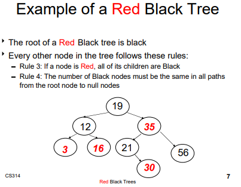
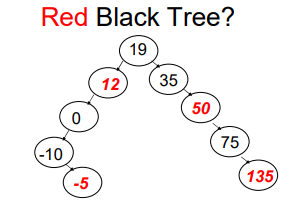
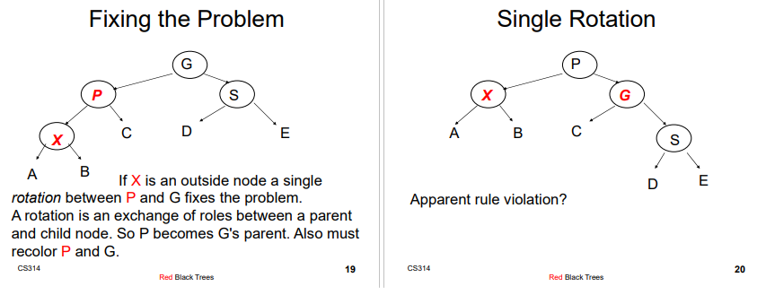
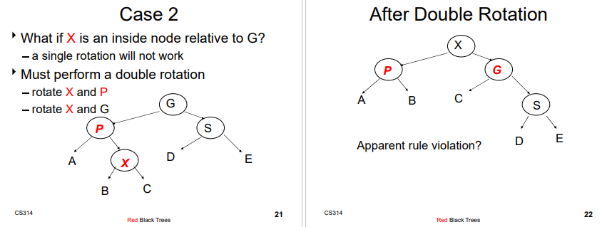

# Breadth First Search
Search algorithm that reads from left to right, top to bottom.
- Ex: Level-order traversal of a binary tree

This algorithm isn't just for trees; it can be implemented for graphs.

### How Breadth First Search (BFS) uses Queues
- Are we at the target Node?
	- If no, enqueue its children
	- If yes, return the Node we are finished
- Then used the updated Queue on the new children Nodes and repeat the process

# Depth First Search
A search algorithm that reads down the depths and backtracks until it reads
through each depth from top to bottom, backtrack, then right, and repeat.
- This is how recursively backtracking and searching through a tree works

### How Depth First Search (DFS) uses Stacks
- It can be implemented implicitly with the recursive stack
- Or, it can be implemented explicitly with an auxiliary data structure

# Red Black Trees
A binary search tree (BST) with more complex algorithms to ensure balance. Balancing is important because whenever doing operations like add or search within the tree, it would be O(log2(N)) in the worst and average-case for a Red Black Tree. However, if we never balanced a binary search tree; then for example if all Nodes have a chain to the right or to the left (ascending or descending order), it would cause O(N) time for operations like add and search.
- Worst-case height for RBT is 2*log2(N), unlike a conventional Binary Search Tree which is O(N)

</img>

### Red Black Tree (RBT) Rules
1. Every Node is colored red or black
2. The root Node is black
3. If a Node is red, it's children MUST be black (the red rule)
4. Every path from a Node to a null link must contain the same number of black Nodes
	- For every possible path from the Node till a null link, count the number of black Nodes and check if every path until a null link has the same number of black Nodes
	- This rule helps ensure the balancing of the tree
	
### Example of a Violation of Rule 4
</img>

The red black tree above violates rule 4 because starting from the root Node, not every path till a null-link has the same number of black Nodes. For example, go from Node 19 (root) to Node 12, then go right of Node 12 it's a null link so there's only 1 black Node which is the root. Now go from Node 19, to Node 12, then Node 0, then go to the right of Node 0 and there's 2 black Nodes for this path, which is different from the 1 black Node of the previous path. Therefore, the tree is not a red black tree.

### When to fix an unbalanced tree?
Whenever there are 2 red Nodes linked together, we must rotate the Nodes because the links would become too unbalanced if there were more inserts.

### Case 1 Fixing RBT (Single Rotation)
Case 1: Whenever the sibling of the parent is black.

</img>

### Case 2 Fixing RBT (Double Rotation)
</img>

### How to prevent Case 3 Fixing RBT
Case 3: Whenever a sibling is red, not black.
If we see a Node X that has 2 Red children, we make Node X Red and its two children black
- If re-coloring the root, re-color it to black
- The number of black nodes on paths below Node X remains
unchanged
- If X's parent was Red then we have introduced 2
consecutive Red nodes.
	- To fix this, apply rotations to the tree, like inserting a node
