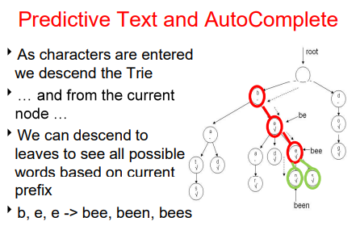

# Tries
A general tree in which each NOde stores a character and data structure (list) to refer to its children.
- Can contain multiple children for each Node, so it's not a binary tree
- Stores words or phrases in a dictionary as a Tree

Tries are used for auto-completion programs because a user can traverse through a tree whenever typing in characters,
in which the Trie would list its children Nodes and all potential words that the client may type.

</img>

Tries must use a terminator in order to indicate if ending at a Node would create a word. This is usually a boolean variable
within the Trie Node.

### Trie Node
- boolean isWordEnding, true if this Node would create a word from traversing the trie
- ArrayList children, a list of children Nodes
- E data, the data (typically a char) of the Node

# Compressed Tries
SOme words, especially long words, can create a chain of NOdes within a single child.
- Reduces the number of Nodes storing Strings instead of characters for the data
- Compresses chain of characters that create a word into a String, so the program does
 not have to be a chain that terminates within a leaf Node
 
</img>
